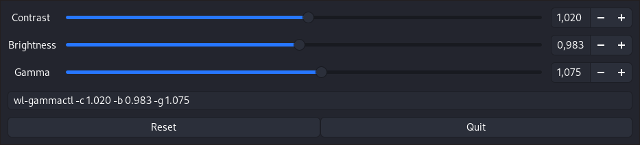

# wl-gammactl



Small GTK GUI application to set contrast, brightness and gamma for wayland compositors which support the wlr-gamma-control protocol extension.
Basically this is the example from here: https://github.com/swaywm/wlroots/blob/master/examples/gamma-control.c
with a nice little GTK GUI slapped on to it. You can set contrast, brightness and gamma using sliders and reset back to default values.


This was made to make the process of calibrating your monitor a bit easier, since wayland support for color profiles is not yet implemented.
When you are satisfied with your settings, copy the given command line and execute it at startup to make the settings load at apply on every boot.


Keep in mind that it uses the same protocol extension like the redshift fork https://aur.archlinux.org/packages/redshift-wlr-gamma-control/  
When running wl-gammactl it will kick out any running redshift instance and fail to start up. On second run it should work as expected.
So unfortunatly only one can run at a time (?) for now.

# Build
For most use cases this should do:  
Clone the repository and
```console
$ meson build
$ ninja -C build
```

# Run
Call without any arguments to run the GUI
```console
$ wl-gammactl
```

Call with arguments to set values without GUI, eg:
```console
$ wl-gammactl -c 0.996 -b 1 -g 1.05
```
Call with arguments to set values for a specified monitor.

```console
$ wl-gammactl -m eDP-1 -c 0.996 -b 1 -g 1.05
```

Useful for calling on startup


